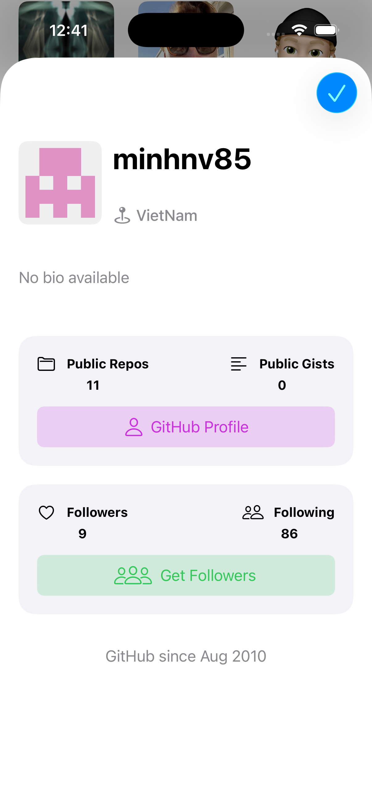

# GFFollowers

iOS GitHub followers app built with **Swift and UIKit**.

---

## 📱 Features
- Search for any GitHub user
- Display followers list
- Pagination support
- Empty state view
- Error handling

---

## 🛠 Tech Stack
- Swift
- UIKit
- URLSession
- MVC / MVVM
- GitHub REST API

---

## 📸 Screenshots

| Search | Followers List | User Details |
|------|---------------|--------------|
|  |  |  |
---

## 🚀 Getting Started
1. Clone the repository:
```bash
git clone https://github.com/TaherLamloum/GFFollowers.git
